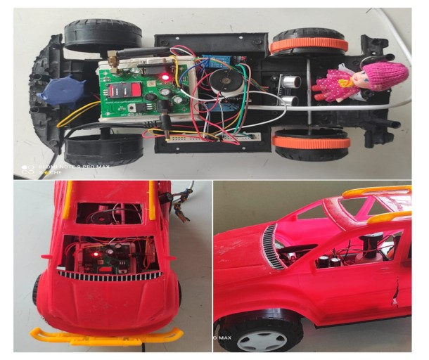
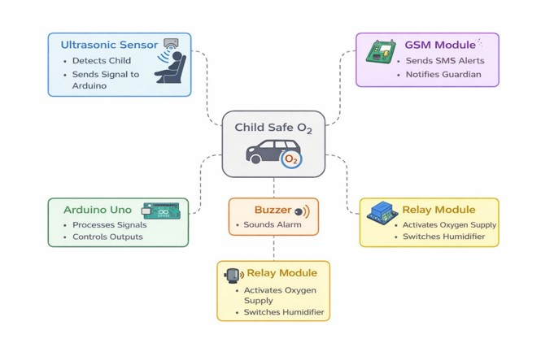

<h1 align="center">🚗 Child Safe O2</h1>
<h3 align="center">Embedded Vehicle Safety System • Real-Time Detection • GSM Alerts • Independent Ventilation</h3>

Preventing fatal child entrapment incidents using autonomous embedded intervention

---

## ⚡ Overview

Child Safe O2 is an embedded safety system designed to prevent fatal accidents where infants are unintentionally left inside locked vehicles.

Unlike reminder-based solutions, this system performs **real-time detection, automatic alerting, and active ventilation support** without requiring human action.

The system continues to operate even when the vehicle ignition is OFF using an independent power circuit.

This project was built as part of a student team project, where I worked on detection logic, GSM alert system, and ventilation control design.

---

## 🚨 Problem

Every year, children lose their lives after being left inside parked vehicles due to:

- rapid temperature increase  
- oxygen drop  
- lack of real-time monitoring  
- delayed caregiver response  

Existing solutions only provide reminders and do not perform active intervention.

A reliable, low-cost, autonomous safety system is required.

---

## 💡 Proposed System

Child Safe O2 performs:

✔ Real-time child detection  
✔ Automatic SMS/CALL alert to caregiver  
✔ Emergency ventilation / oxygen support  
✔ Works when car power is OFF  
✔ Independent monitoring loop  
✔ Fail-safe hardware design  

System reacts automatically once powered.

---

## 🧠 System Architecture

PIR Sensor  
↓  
Arduino UNO  
↓  
GSM Module ──► SMS Alert & CALL 
↓  
Relay Control  
↓  
Ventilation / Oxygen Module  

---

## 🔩 Hardware Components

- Arduino UNO (Main Controller)
- GSM SIM900A Module
- PIR Motion Sensor
- Relay Module
- Buzzer
- Humidifier / Fan (Ventilation)
- External Power Supply
- Breadboard & Driver Circuit

---

## ⚙️ Working Logic

1. System initializes all modules  
2. PIR sensor checks for motion / presence  
3. If child detected:
   - buzzer activated
   - SMS sent via GSM
   - relay enables ventilation
4. System continues monitoring
5. Works even when ignition is OFF

Fail-safe loop ensures continuous operation.

---

## 💻 Software

- Arduino IDE
- Embedded C / C++
- GSM AT Commands
- PIR input detection
- Relay control logic

Features:

- real-time monitoring
- automatic alert trigger
- continuous loop execution
- independent power handling

---

## 🔌 Hardware Design Highlights

- Independent power circuit
- Lock-state detection logic
- Relay-based ventilation control
- GSM communication module
- Low-cost scalable design

Designed for real-world deployment.

---

## 📷 Project Model

## 🔧 System Diagram

---

## 📊 Results

✔ Detects child inside locked vehicle  
✔ Sends instant SMS alert  
✔ Activates ventilation automatically  
✔ Works without ignition power  
✔ Tested under multiple scenarios  

---

## 🏆 Achievement

🥇 **1st Place — IGNITE 2026 National Level Project Expo**  
860+ teams participated  
Live working prototype demonstrated

---

## 📂 Code

Arduino source file:

Contains:

- PIR detection logic
- GSM communication
- relay control
- safety loop

---

## 👤 Author

Divyaanshu Tonk  
Hyderabad, India  

GitHub  
https://github.com/DivyaanshuXD

LinkedIn  
https://linkedin.com/in/divyaanshutonk
